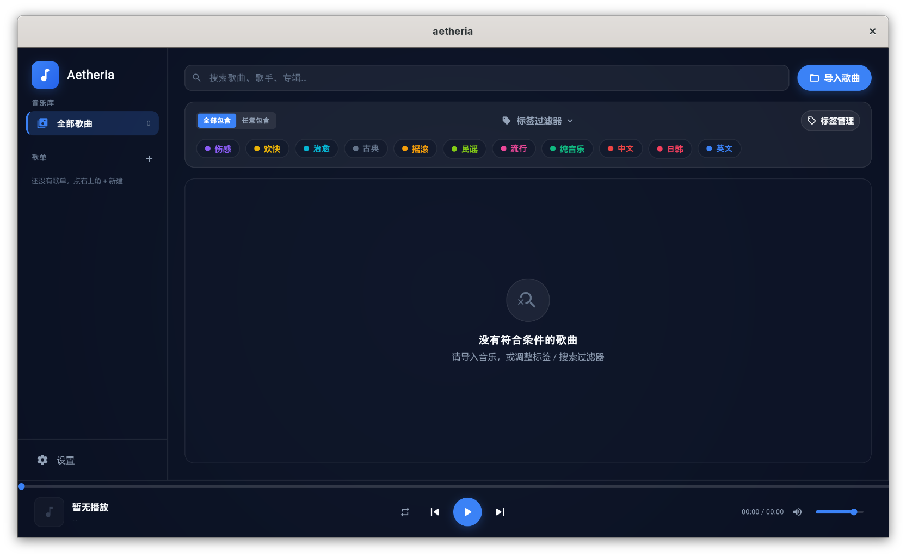

# 黑屏修复与可见画面验证 · 2026-10-08

之前发布的自定义引擎会提交黑帧。只检查进程、Flutter 测试结果和 `wp_presentation` 时间戳未能发现这个问题，导致错误地认定新版界面可用。原性能报告已标记失效，旧数据不能证明正确画面达到 165fps。

## 根因与修复

Flutter 先在没有 EGL surface 的上下文中渲染，默认 framebuffer 的 draw buffer 保持为 `GL_NONE`。切换到 EGL window surface 后，这个状态没有自动改变。`glBlitFramebuffer` 返回成功、`eglSwapBuffers` 正常提交，但没有写入窗口像素。诊断中 Flutter framebuffer 有完整画面，EGL 窗口 RGBA 全部为零，draw buffer 为 0。

修复在 blit/clear 前显式选择 `GL_BACK`，完成后恢复引擎原有 draw buffer。另一个真实截图发现的问题是中文变成缺字方框：通用 GN 配置默认关闭系统字体发现。构建脚本现强制开启 `skia_use_fontconfig` 和 `flutter_use_fontconfig`，包含复用已有输出目录的情况。

## 验证

- 正式应用的实际 KWin 窗口截图已检查：布局、图标及中文搜索框、标签、按钮正常。
- `scripts/test_linux_high_refresh.sh` 现在通过 `AETHERIA_FRAME_CAPTURE` 读取 Flutter framebuffer 与 EGL window buffer，验证有内容的帧逐字节相等。本轮验证 8 帧通过；旧黑屏代码会在此失败。
- 同一 Release 引擎的缩放、最大化、两次隐藏恢复及销毁检查通过；两次恢复后第一秒分别呈现 147 / 132 帧。
- 性能测试单独运行并关闭像素读回。在预热阶段实际截取窗口，确认显示移动的绿色矩形；统计随后完整的 9 秒。

| 正确画面的 Release 测量 | 结果 |
| --- | ---: |
| 实际呈现帧率 | 165.003fps |
| 呈现帧数 | 1,485 |
| 时间跨度 | 8.994s |
| 帧间隔 P50 | 6.060ms |
| 帧间隔 P95 | 6.168ms |
| 帧间隔 P99 | 6.210ms |
| 最长间隔 | 6.289ms |
| 超过 1.5 个刷新周期的间隔 | 0 |
| trace 中 discarded 数 | 0 |

该结果针对本机 KDE Wayland、NVIDIA RTX 4060 Laptop、165Hz 显示器上的持续轻量动画。复杂 UI、封面解码、音频/DSP、混合刷新率多屏及其他驱动不由此保证满帧。

[统计与测试输出](linux-visible-rendering-2026-10-08.json) · [原始呈现数据](linux-visible-rendering-2026-10-08.csv.gz) · [实际动画截图](linux-visible-benchmark-2026-10-08.png) · [构建及复测方式](../../linux/engine/README.md)

